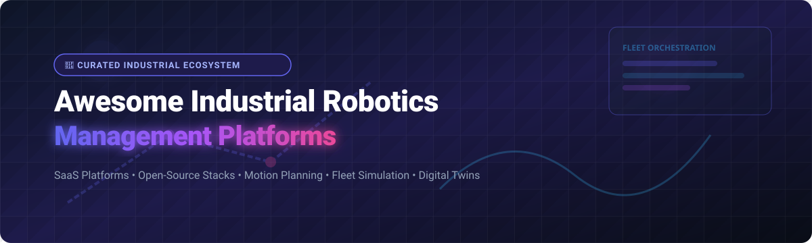

# 🤖 Awesome Industrial Robotics Management 🚀

  
  
  
  
  

## 📌 Overview & Top Platforms Ecosystem

**Curated List of SaaS Products, Industrial Automation Software & Open-Source GitHub Projects**

*Focused on Robot Programming, Physics Simulation, Collision-Free Path Planning, Fleet Coordination & Software-Defined Automation.*

> 💡 **Market Insights**: The global **Industrial Robotics Software & Management market** is estimated at **$7.5 Billion (2026)** and is growing at ~14.5% CAGR. The sector is **moderately fragmented**, split between traditional incumbent robot OEMs (ABB, FANUC, KUKA, Yaskawa) providing proprietary offline suites and fast-growing software-defined SaaS / low-code orchestration layers (Vention, Ready Robotics, Realtime Robotics, Formic).

---

## 📑 Table of Contents
- [🏢 SaaS & Hosted Platforms](#-saas--hosted-platforms)
- [🔓 Open-Source GitHub Projects](#-open-source-github-projects)
- [🛠️ Architecture & Hybrid Workflows](#%EF%B8%8F-architecture--hybrid-workflows)
- [🤝 How to Contribute](#-how-to-contribute)
- [💖 Support & Community](#-support--community)
- [⚠️ Disclaimer](#%EF%B8%8F-disclaimer)
- [📈 Star History](#-star-history)

---

## 🏢 SaaS & Hosted Platforms

> [!NOTE]
> Below is a curated breakdown of major SaaS and commercial software-defined automation suites, ordered by company size and market valuation/revenue (descending).

| Platform | Starting Price | Free Tier / Trial Limit | Company Size / Valuation / Revenue | Description |
| :--- | :--- | :--- | :--- | :--- |
| **[ABB RobotStudio](https://new.abb.com/products/robotics/robotstudio)** | $1,500 / year per seat | 30-day full-featured free trial | ~$32.2B Market Cap (ABB Robotics segment: ~$3.5B revenue) | Premium offline programming & 3D virtual commissioning environment for ABB industrial robots. |
| **[FANUC ROBOGUIDE](https://www.fanucamerica.com/)** | $2,500 / license | 30-day evaluation trial | ~$28.0B Market Cap (FANUC Corporation) | Offline 3D simulation, cell layout design, and cycle-time analysis tool for FANUC robots. |
| **[KUKA iiQWorks / KUKA.Sim](https://www.kuka.com/)** | $1,800 / year per user | 14-day free trial | ~$4.1B Valuation (Midea Robotics & Automation) | Engineering and smart simulation suite for planning, programming, and optimizing KUKA robot cells. |
| **[Universal Robots PolyScope X](https://www.universal-robots.com/)** | Included with UR Hardware ($1,200/yr software updates) | 30-day offline simulation trial (URSim) | ~$1.0B Revenue (Teradyne Robotics Division) | Next-generation software platform and runtime environment for UR collaborative robots. |
| **[Yaskawa Compass / MotoSim](https://www.yaskawa-global.com/)** | $1,200 / license | 30-day trial license | ~$950M Revenue (Yaskawa Robotics Division) | Offline robot programming, path planning, and 3D cell virtual design software for Motoman robots. |
| **[Vention MachineBuilder](https://www.vention.io/)** | $240 / month (Professional Tier) | Free Forever Tier (Basic 3D Design & 1 Active Project) | ~$500M Valuation ($100M+ total raised) | Cloud-based software-defined automation platform for designing, simulating, and operating modular robot cells. |
| **[Formic](https://www.formic.co/)** | $8.00 / robot-hour (RaaS model) | 14-day risk-free pilot program | ~$150M Valuation ($65M+ total raised) | Robotics-as-a-Service (RaaS) platform deploying software-defined automated workflows for manufacturing. |
| **[Realtime Robotics](https://www.rtr.ai/)** | $950 / month per cell controller | 30-day proof-of-concept trial | ~$100M Valuation ($60M+ total raised) | Autonomous collision-free motion planning and real-time multi-robot cell orchestration software. |
| **[Ready Robotics](https://www.ready-robotics.com/)** | $450 / month per robot node | 14-day sandbox cloud trial | ~$60M Valuation ($45M+ total raised) | Forge OS universal robot operating platform simplifying industrial automation and task orchestration. |
| **[Wandelbots](https://www.wandelbots.com/)** | $350 / month per connected robot | 14-day developer trial | ~$50M Valuation ($30M+ total raised) | No-code robot programming and software platform enabling rapid teaching and simulation validation. |

---

## 🔓 Open-Source GitHub Projects

> [!TIP]
> The open-source industrial robotics stack is thriving. Below are leading open repositories ordered by GitHub Star count (descending).

| Project & Repository | Stars | Description |
| :--- | :--- | :--- |
| **[ROS 2 (Robot Operating System)](https://github.com/ros2/ros2)** |  | Industry standard middleware framework for robot drivers, state estimation, and industrial control. |
| **[Gazebo / Gazebo Sim](https://github.com/gazebosim/gz-sim)** |  | High-fidelity 3D multi-robot physics simulation engine for virtual cell commissioning. |
| **[MoveIt 2](https://github.com/moveit/moveit2)** |  | Advanced manipulation framework providing kinematics, collision-free motion planning, and 3D perception. |
| **[Open-RMF (Robotic Middleware Framework)](https://github.com/open-rmf/rmf_core)** |  | Heterogeneous fleet management and interoperable task dispatching for industrial mobile & manipulator robots. |
| **[Universal Robots ROS 2 Driver](https://github.com/UniversalRobots/Universal_Robots_ROS2_Driver)** |  | Official industrial-grade ROS 2 driver with real-time control for Universal Robots manipulators. |
| **[OMPL (Open Motion Planning Library)](https://github.com/ompl/ompl)** |  | Core sampling-based motion planning algorithms powering industrial arm path planning. |
| **[ROS-Industrial Core](https://github.com/ros-industrial/ros_industrial_core)** |  | Specialized ROS packages and industrial robot joint trajectories for factory automation. |
| **[Robotics Library (RL)](https://github.com/roboticslibrary/rl)** |  | C++ library for rigid body kinematics, motion planning, spatial vector math, and hardware control. |
| **[Industrial Robotics (JdeRobot)](https://github.com/JdeRobot/IndustrialRobots)** |  | Educational and practical industrial manipulation exercises utilizing ROS 2, MoveIt 2, and Gazebo. |
| **[Tesseract Motion Planning](https://github.com/tesseract-robotics/tesseract)** |  | Environment-aware industrial motion planning and trajectory optimization framework. |

---

## 🛠️ Architecture & Hybrid Workflows

Building robust production systems often involves combining commercial software-defined layers with open-source infrastructure:

1. **Virtual Simulation**: Model environment & cells in **Gazebo Sim** or **Vention MachineBuilder**.
2. **Path Planning**: Generate collision-free trajectories using **MoveIt 2**, **OMPL**, or **Realtime Robotics**.
3. **Hardware Execution**: Stream low-latency commands via **ROS-Industrial** drivers or vendor-native controllers.
4. **Fleet Management**: Orchestrate multiple units with **Open-RMF** or **Ready Robotics**.

---

## 🤝 How to Contribute

Contributions are warmly welcomed! 🌟

1. 🍴 **Fork** the repository.
2. 📝 **Add or update** entries in `README.md` following our structured table format.
3. 🔍 Ensure links are functional and details (pricing, free tiers, stars) are accurate.
4. 🚀 **Submit a Pull Request** with a concise description of your changes.

Check out our curated list meta-repo at [Awesome-Awesome-Awesome](https://github.com/ishandutta2007/Awesome-Awesome-Awesome)!

---

## 💖 Support & Community

If you find this repository helpful, please consider showing your support:

- ⭐ **Star** this repository to help others discover it.
- 🔄 **Share** it with your fellow robotics engineers, automation developers, and colleagues.
- 💬 Join our community on [Discord](https://discord.gg/jc4xtF58Ve) to discuss industrial robotics management.
- ☕ **Buy me a coffee**: If this project saved you time, support the ongoing maintenance on [GitHub Sponsors](https://github.com/sponsors/ishandutta2007)!

---

## ⚠️ Disclaimer

- This repository is a **community-curated list** provided for educational and informational purposes only.
- Industrial robotic systems operate high-payload machinery in physical environments. Always perform rigorous safety risk assessments and comply with ISO 10218 / ISO/TS 15066 standards prior to deployment.

---

## 📈 Star History

